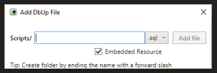
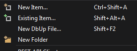

# Add DbUp File

Shamelessly tweaked and stripped down version of Mads Kristensen's excellent AddAnyFile extension. It has one simple purpose - to provide a way 
for easily adding new dbup sql and cs files to any project. Simply hit Shift+F2 to create an empty script file in the selected folder or in the same folder 
as the selected file.  

See the [changelog](CHANGELOG.md) for updates and roadmap.

### Features

- Filenames are automatically prefixed with ccyymmdd_hhmmss_ and restricted to one period
- Marks new sql files as embedded resources (but not cs files)
- Sql and cs templates relevant to dbup

### Show the dialog

A new button is added to the context menu in Solution Explorer.

You can either click that button or use the keybord shortcut **Shift+F2**.

## Contribute
Check out the [contribution guidelines](.github/CONTRIBUTING.md)
if you want to contribute to this project.

For cloning and building this project yourself, make sure
to install the
[Extensibility Tools 2015](https://visualstudiogallery.msdn.microsoft.com/ab39a092-1343-46e2-b0f1-6a3f91155aa6)
extension for Visual Studio which enables some features
used by this project.

## License
[Apache 2.0](LICENSE)